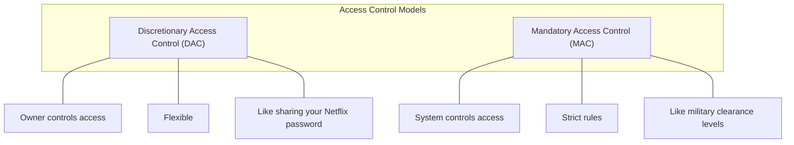
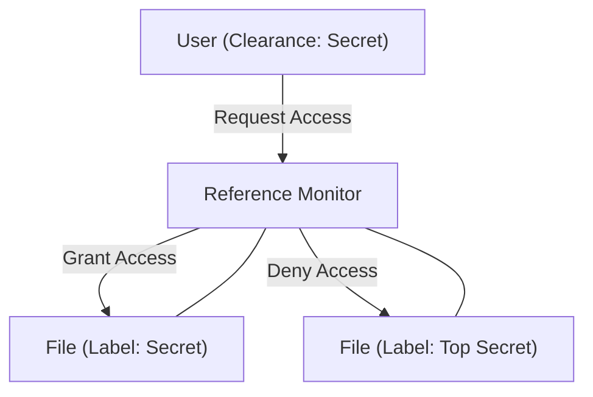

# DAC vs MAC: The Access Control Showdown 🔐

> *"I need to know this by tomorrow morning!"* edition

## Quick Comparison



## Discretionary Access Control (DAC)

### What It Is
DAC lets **resource owners** decide who gets access to their stuff. Think of it as the "it's my toy, I decide who plays with it" model.

### Real-World Example
Your computer's file system! You (the owner) can:
- Create a document
- Set read/write permissions
- Share it with specific friends
- Change these permissions whenever you want

### Technical Implementation
- **Access Control Lists (ACLs)**: Lists of users/groups with their permissions
- **Capability Tables**: Lists of resources a user can access

```
file.txt permissions:
- alice (owner): read, write, execute
- bob: read
- carol: read, write
```

### Pros ✅
- **Flexible**: Change permissions on the fly
- **User-friendly**: Intuitive for most people
- **Granular control**: Can set specific permissions for specific users
- **Low administrative overhead**: Users manage their own stuff

### Cons ❌
- **Security nightmare**: Users make bad decisions
- **Data can leak**: If users copy/share improperly
- **No central control**: Hard to enforce company-wide policies
- **Transitive access problems**: Bob can share Alice's data with Carol

## Mandatory Access Control (MAC)

### What It Is
MAC uses **system-enforced** rules based on security labels. Think of it as the "only people with level 5 clearance can enter this room, no exceptions" model.

### Real-World Example
Military security classifications:
- Documents are labeled: Unclassified, Confidential, Secret, Top Secret
- People have clearance levels
- Your clearance must match or exceed the document's classification to access it

### Technical Implementation
- **Security Labels**: Applied to all subjects (users) and objects (files)
- **Reference Monitor**: Enforces rules about which labels can interact
- **No Override**: Even administrators can't bypass the rules



### Pros ✅
- **Strong security**: Enforced by the system, not users
- **Data leak prevention**: Strict rules prevent unauthorized sharing
- **Consistent policy**: Same rules applied everywhere
- **Regulatory compliance**: Good for highly-regulated industries

### Cons ❌
- **Rigid**: Little flexibility for exceptions
- **Complex administration**: Setting up all the labels is hard
- **Overhead**: Performance impact from constant checking
- **User frustration**: "But I just need this one file!"

## Key Differences (Exam Material! 📝)

| Feature | DAC | MAC |
|---------|-----|-----|
| Who controls? | Resource owners | System/security policy |
| Policy basis | Identity (who you are) | Classification (security levels) |
| Flexibility | High | Low |
| Security strength | Lower | Higher |
| Example systems | Windows/Linux file permissions | SELinux, TrustedSolaris |
| Data flow control | Weak | Strong |
| Implementation complexity | Simple | Complex |

## Real-world Examples

### DAC Systems
- Windows NTFS permissions
- Unix file permissions (chmod)
- Google Drive sharing
- Database user grants

### MAC Systems
- SELinux
- Security-Enhanced Android
- Military computer systems
- Healthcare systems with strict HIPAA compliance

## Remember This!

If your exam asks which one to use:
- Need security for sensitive data? → MAC
- Need flexibility and ease of use? → DAC
- Implementing military systems? → MAC
- Building a social media platform? → Probably DAC

---

Good luck on your exam! Remember: DAC is like lending your car to friends (you decide who), while MAC is like airport security (the system decides based on strict rules).