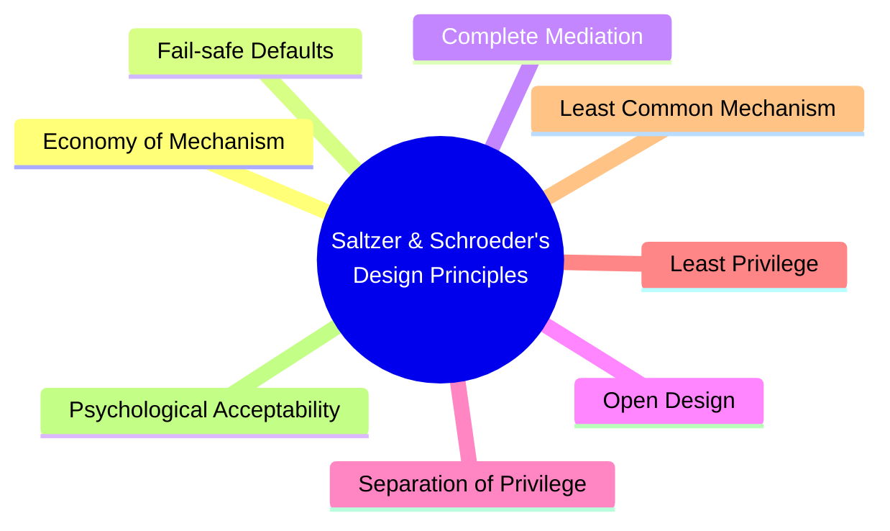
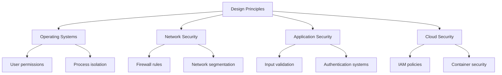

# Saltzer and Schroeder's 8 Design Principles for Security 🔒

> *"The essential security concepts you need to know for tomorrow's exam"*

## Overview

In 1975, Jerome Saltzer and Michael Schroeder published "The Protection of Information in Computer Systems," which outlined 8 fundamental design principles for security. These principles have stood the test of time and remain the foundation of secure system design.

## The 8 Design Principles Explained

### 1. Economy of Mechanism (Keep It Simple) 🧩

**Core Idea**: Keep the design as simple and small as possible.

**Why It Matters**: Complex systems have more potential vulnerabilities and are harder to test, analyze, and implement correctly.

**Example**: 
- ✅ A firewall with clear, straightforward rules
- ❌ A complex security system with numerous exceptions and special cases

**Modern Application**: Microservices architecture that isolates components with simple, well-defined interfaces rather than monolithic applications.

**Remember**: "Complexity is the enemy of security."

### 2. Fail-safe Defaults (Default Deny) 🚫

**Core Idea**: Base access decisions on permission rather than exclusion. The default should be no access.

**Why It Matters**: If something goes wrong, the system should fail in a secure state rather than allowing inappropriate access.

**Example**:
- ✅ A new file is created with read-only permissions by default
- ❌ A system that grants full access unless restrictions are explicitly specified

**Modern Application**: Cloud services that default to private access and require explicit configuration to make resources public.

**Remember**: "When in doubt, deny access."

### 3. Complete Mediation (Check Every Access) 🔍

**Core Idea**: Every access to every object must be checked for authority.

**Why It Matters**: Bypassing access checks creates security vulnerabilities. Caching access decisions can lead to problems if permissions change.

**Example**:
- ✅ A system that verifies permissions on every file access
- ❌ A system that checks permissions once at login and never again

**Modern Application**: Stateless authentication tokens that must be validated with every API request.

**Remember**: "Trust, but verify—every single time."

### 4. Open Design (No Security by Obscurity) 🔓

**Core Idea**: The security of a mechanism should not depend on the secrecy of its design or implementation.

**Why It Matters**: Secret designs can't be thoroughly reviewed for flaws and will eventually be discovered anyway.

**Example**:
- ✅ Public cryptographic algorithms that have been extensively reviewed
- ❌ A proprietary encryption method kept secret to "enhance" security

**Modern Application**: Open-source security tools and libraries that undergo public scrutiny.

**Remember**: "Security through obscurity is no security at all."

### 5. Separation of Privilege (Two-Person Rule) 👥

**Core Idea**: A system should grant access based on more than one condition.

**Why It Matters**: Requiring multiple conditions for access reduces the chance of accidental or malicious breach.

**Example**:
- ✅ A bank vault that requires two keys held by different people
- ❌ A single administrator password that grants complete system access

**Modern Application**: Multi-factor authentication requiring something you know (password) and something you have (phone).

**Remember**: "Don't put all your eggs in one security basket."

### 6. Least Privilege (Need-to-Know) 🔑

**Core Idea**: Every program and user should operate using the least set of privileges necessary to complete the job.

**Why It Matters**: Minimizes the damage that can result from accidents or errors and reduces the number of potential interactions that could lead to security breaches.

**Example**:
- ✅ A web server running as a limited user that can only access specific directories
- ❌ Applications running with administrator/root privileges by default

**Modern Application**: Container technologies that isolate applications with minimal required permissions.

**Remember**: "Give only what's needed, nothing more."

### 7. Least Common Mechanism (Minimize Sharing) 🚧

**Core Idea**: Minimize the amount of mechanism common to more than one user and depended on by all users.

**Why It Matters**: Shared mechanisms can become a channel through which information or privileges can be inappropriately transmitted.

**Example**:
- ✅ Virtual machines that provide isolated environments for different applications
- ❌ A single shared temp directory used by all system processes

**Modern Application**: Serverless functions that execute in isolated environments.

**Remember**: "Sharing is caring, except in security."

### 8. Psychological Acceptability (Usability) 😊

**Core Idea**: Security mechanisms should not make the resource more difficult to access than if the security mechanisms were not present.

**Why It Matters**: If security is too cumbersome, users will find ways to bypass it.

**Example**:
- ✅ Single sign-on systems that simplify authentication across multiple services
- ❌ Complex password policies that lead users to write passwords on sticky notes

**Modern Application**: Biometric authentication that's both secure and convenient.

**Remember**: "If it's not usable, it's not secure in practice."

## Practical Applications

### Operating Systems
- **Least Privilege**: User accounts with limited permissions
- **Economy of Mechanism**: Minimal trusted computing base
- **Complete Mediation**: Kernel-level access control checks

### Network Security
- **Fail-safe Defaults**: Default-deny firewall policies
- **Separation of Privilege**: Network segmentation
- **Least Common Mechanism**: VLAN isolation

### Application Security
- **Open Design**: Public cryptographic algorithms
- **Complete Mediation**: Checking permissions on every API call
- **Psychological Acceptability**: Intuitive security interfaces

### Cloud Security
- **Least Privilege**: IAM roles with minimal permissions
- **Fail-safe Defaults**: Private by default resources
- **Separation of Privilege**: Multi-factor authentication

## Real-World Examples

### Economy of Mechanism
- **Unix Philosophy**: "Do one thing and do it well"
- **SSH**: Simple, focused security protocol

### Fail-safe Defaults
- **AWS S3 Buckets**: Private by default
- **Android App Permissions**: Explicit user approval required

### Complete Mediation
- **OAuth 2.0**: Validates tokens on every request
- **SELinux**: Checks permissions at every system call

### Open Design
- **TLS/SSL**: Public protocols, extensively reviewed
- **Linux Security Modules**: Open-source security frameworks

### Separation of Privilege
- **Nuclear Launch Controls**: Two-person rule
- **Git Merge Approvals**: Requires author and reviewer

### Least Privilege
- **Docker Containers**: Isolated with minimal permissions
- **sudo**: Temporary elevation of privileges

### Least Common Mechanism
- **Virtual Machines**: Isolated environments
- **Process Sandboxing**: Limits resource sharing

### Psychological Acceptability
- **Password Managers**: Make complex passwords usable
- **FaceID/TouchID**: Secure but convenient authentication

## Exam Tips 📝

- **Remember All 8**: Economy of Mechanism, Fail-safe Defaults, Complete Mediation, Open Design, Separation of Privilege, Least Privilege, Least Common Mechanism, Psychological Acceptability
- **Understand Tradeoffs**: Security often conflicts with convenience
- **Recognize Violations**: Be able to identify when principles are being broken
- **Modern Context**: Apply these principles to current technologies
- **Interconnections**: Understand how these principles work together

## Quick Reference Table

| Principle | Key Phrase | Modern Example |
|-----------|------------|----------------|
| Economy of Mechanism | "Keep it simple" | Microservices |
| Fail-safe Defaults | "Default deny" | Private cloud resources |
| Complete Mediation | "Check every access" | JWT validation on every API call |
| Open Design | "No security by obscurity" | Open-source encryption |
| Separation of Privilege | "Two-person rule" | Multi-factor authentication |
| Least Privilege | "Need-to-know basis" | Container permissions |
| Least Common Mechanism | "Minimize sharing" | VM isolation |
| Psychological Acceptability | "Make security usable" | Biometric authentication |

---

Remember: These principles were defined in 1975 but remain remarkably relevant today. They provide a foundation for evaluating any security system, from operating systems to cloud architectures.

Good luck on your exam! 🍀