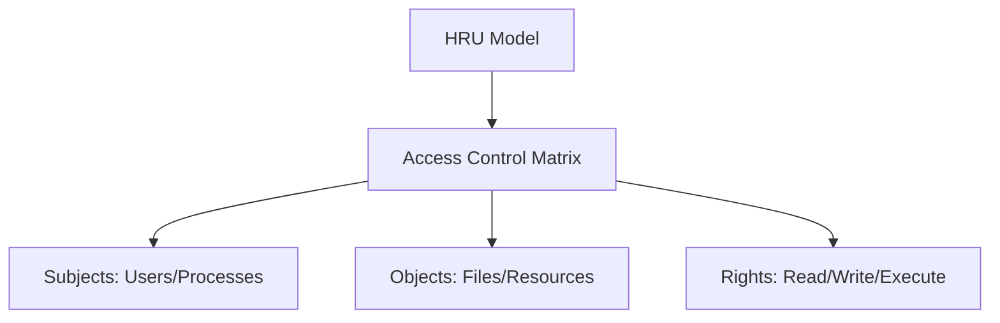
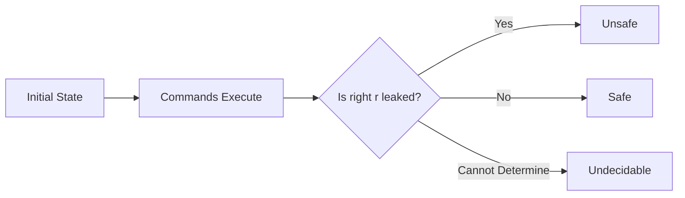
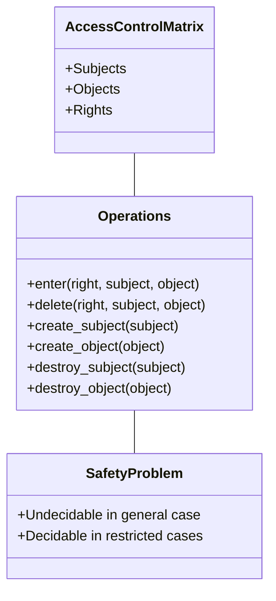

# HRU Model: The Access Control Matrix 🧮

> *"Last-minute cramming for tomorrow's exam"* edition

## What is the HRU Model? 🤔

The Harrison-Ruzzo-Ullman (HRU) model is a **formal security model** that uses an **access control matrix** to represent permissions in a system. Named after its creators (Michael Harrison, Walter Ruzzo, and Jeffrey Ullman), it's a theoretical foundation for analyzing access control systems.



## The Access Control Matrix Explained 📊

Imagine a giant spreadsheet:
- **Rows**: Subjects (users, processes)
- **Columns**: Objects (files, resources)
- **Cells**: Rights (read, write, execute, own)

```
| Subject\Object | File1 | File2 | Process1 |
|----------------|-------|-------|----------|
| Alice          | r,w,o | r     | execute  |
| Bob            | r     | r,w,o | -        |
| Process1       | r,w   | -     | -        |
```

## Implementation Approaches 🛠️

The matrix can be stored in two ways:

### 1. Access Control Lists (ACLs)
Store the matrix by **columns** - each object has a list of subjects and their rights.

```
File1:
  - Alice: read, write, own
  - Bob: read
  - Process1: read, write
```

### 2. Capability Lists
Store the matrix by **rows** - each subject has a list of objects and their rights.

```
Alice:
  - File1: read, write, own
  - File2: read
  - Process1: execute
```

## HRU Commands and Operations ⚙️

The model defines a set of **primitive operations**:
- `enter r into A[s,o]`: Add right r for subject s to object o
- `delete r from A[s,o]`: Remove right r for subject s from object o
- `create subject s`: Add a new subject
- `create object o`: Add a new object
- `destroy subject s`: Remove a subject
- `destroy object o`: Remove an object

These primitives are combined into **commands** that modify the access matrix:

```
command grant_read(s1, s2, o)
    if "own" in A[s1,o] then
        enter "read" into A[s2,o]
    end
```

## The Safety Problem ⚠️

The HRU model is famous for proving the "**safety problem**":

> Is it possible to determine if a right can be leaked to an unauthorized subject?

Harrison, Ruzzo, and Ullman proved this problem is **undecidable** in the general case - meaning there's no algorithm that can always determine if a system is secure!



## Restricted Models 🔒

While the general HRU model is undecidable, restricted versions can be analyzed:

- **Mono-operational**: Commands contain only one operation (decidable)
- **Mono-conditional**: Commands have at most one condition (still undecidable)
- **Acyclic**: No cycles in the creation of subjects/objects (decidable)

## Pros and Cons

### Pros ✅
- **Theoretical foundation**: Provides mathematical basis for access control
- **Flexible representation**: Can model many access control policies
- **Conceptual clarity**: Matrix visualization makes permissions clear
- **Proved important limits**: Showed fundamental security limitations

### Cons ❌
- **Impractical for large systems**: Matrix becomes huge and sparse
- **Static model**: Doesn't handle dynamic aspects well
- **Undecidability result**: Limits automated security verification
- **Implementation overhead**: Storing full matrix is inefficient

## Real-world Relevance 🌍

While you won't directly implement an HRU model, its concepts appear in:

- Operating system access control
- Database permission systems
- Security policy analysis tools
- Formal verification of security properties

## Exam Tips 📝

If asked about HRU model:

1. **Define it**: "A formal security model using an access control matrix"
2. **Describe the matrix**: "Rows are subjects, columns are objects, cells contain rights"
3. **Mention the safety problem**: "Proved that determining if rights can leak is undecidable"
4. **Know the primitives**: "Six basic operations: enter, delete, create subject/object, destroy subject/object"
5. **Implementation approaches**: "Can be implemented as ACLs or capability lists"

## Visual Summary 🖼️



---

Remember: The HRU model isn't something you'll code tomorrow, but it's a fundamental theoretical model that helps us understand the limitations of access control systems. It's like learning about Turing machines - theoretical but foundational!

Good luck on your exam! 🍀