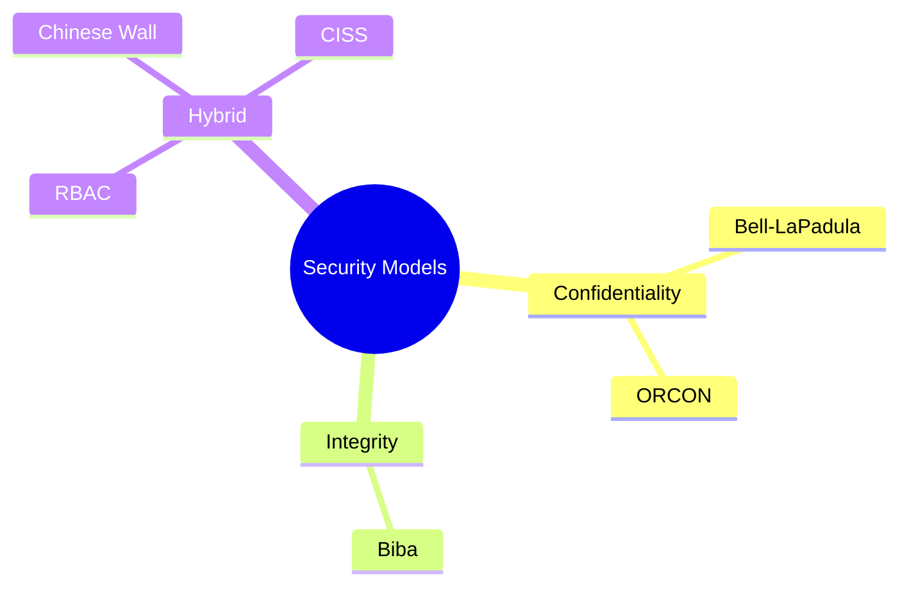

# Security Models: Quick Comparison Guide 📊

## Core Access Control Models at a Glance

## Quick Comparison Table

| Model | Primary Focus | Key Principle | Best For | One-Line Summary |
|-------|--------------|--------------|----------|------------------|
| **Bell-LaPadula** | Confidentiality | No Read Up, No Write Down | Military/classified info | "Keep secrets from flowing downward" |
| **Biba** | Integrity | No Read Down, No Write Up | Critical systems | "Keep untrusted data from corrupting trusted systems" |
| **RBAC** | Simplification | Permissions via roles | Enterprise environments | "You get access based on your job, not who you are" |
| **Chinese Wall** | Conflict prevention | Dynamic separation | Financial/consulting | "Once you've seen Company A's data, you can't see their competitors'" |
| **CISS** | Healthcare privacy | Treatment relationships | Medical systems | "Doctors see their patients' records, with emergency overrides" |
| **ORCON** | Creator control | No redistribution | Intellectual property | "Creator decides who can see their data, even after sharing" |

## Key Distinctions

- **BLP vs. Biba**: Opposite rules - BLP protects secrecy, Biba protects integrity
- **RBAC vs. DAC**: RBAC assigns permissions to roles, DAC to individual users
- **Chinese Wall vs. ORCON**: Chinese Wall prevents conflicts of interest; ORCON preserves creator control
- **CISS vs. RBAC**: CISS adds relationship and context to basic RBAC for healthcare

## Remember These Unique Features

- **BLP**: Military classification levels (Top Secret → Secret → Confidential → Unclassified)
- **Biba**: Integrity levels (High → Medium → Low)
- **RBAC**: NIST levels (Core → Hierarchical → Constrained → Symmetric)
- **Chinese Wall**: Conflict of interest classes containing company datasets
- **CISS**: Break-glass emergency access with mandatory auditing
- **ORCON**: No sharing without originator permission

## When to Use Each Model

- Need military-grade confidentiality? → **Bell-LaPadula**
- Need to protect system integrity? → **Biba**
- Need administrative efficiency? → **RBAC**
- Need to prevent business conflicts? → **Chinese Wall**
- Need healthcare-specific controls? → **CISS**
- Need to control information after sharing? → **ORCON**

---

Remember: Each model addresses specific security concerns - no single model is perfect for all situations. Real-world systems often implement multiple models in combination.