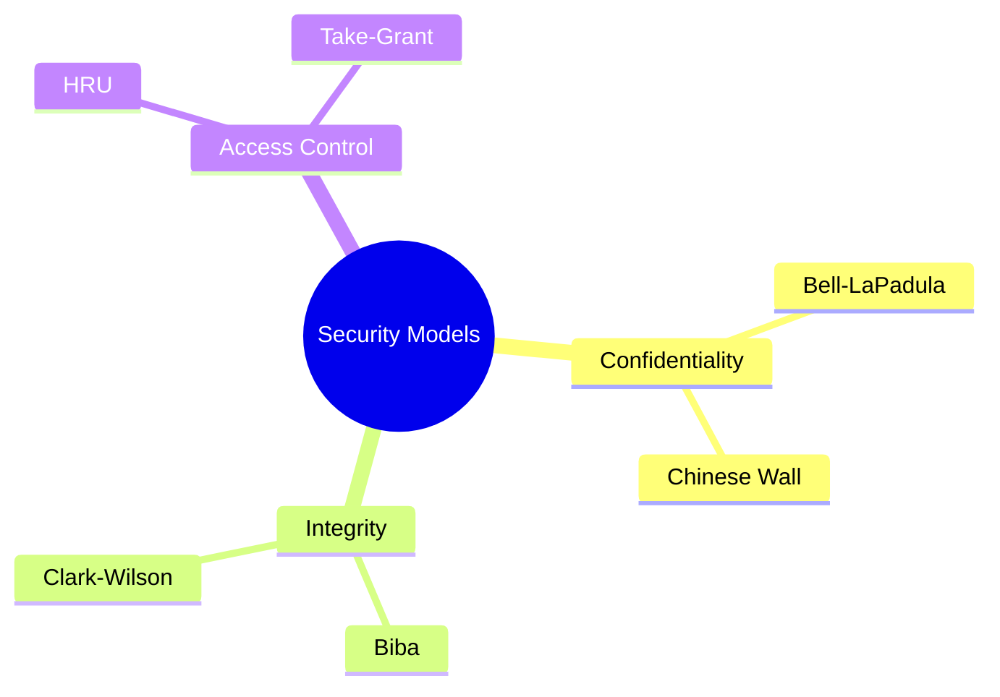
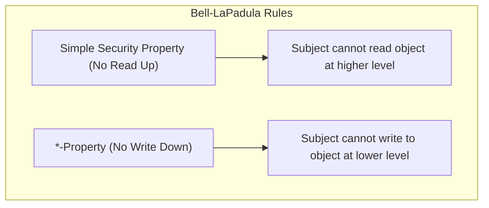
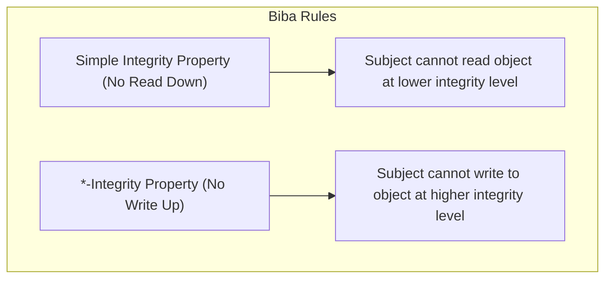
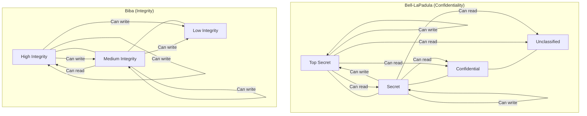
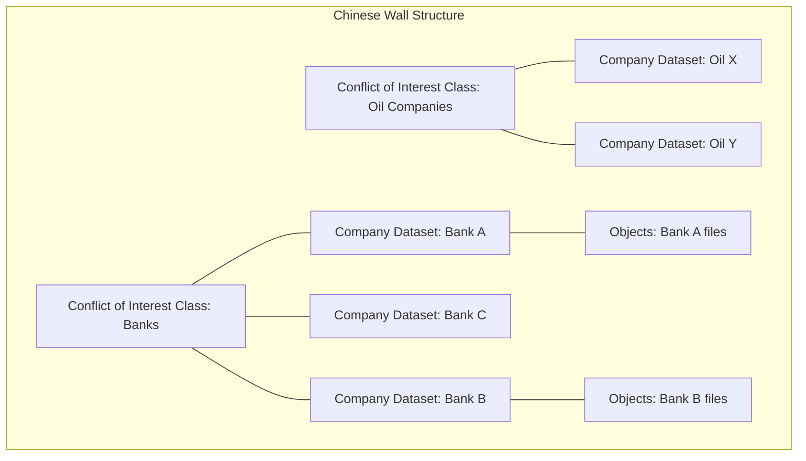
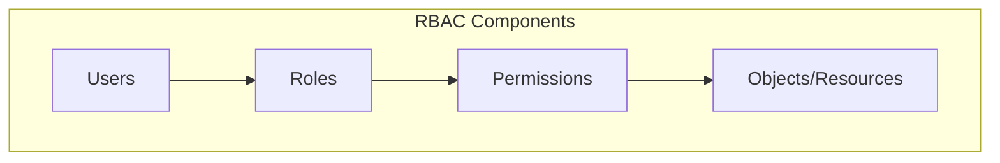
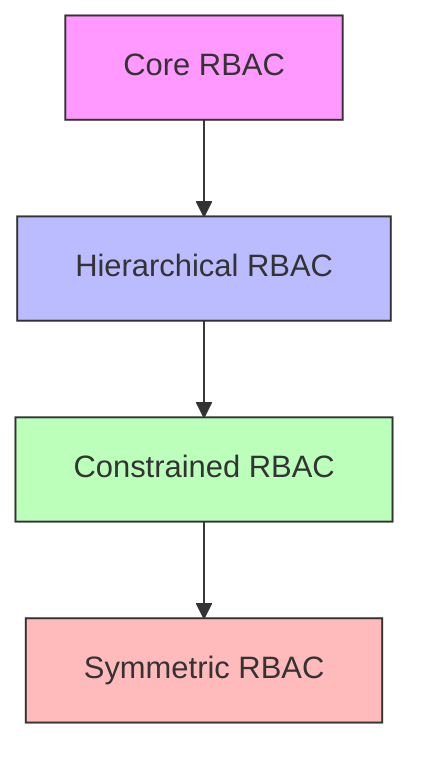
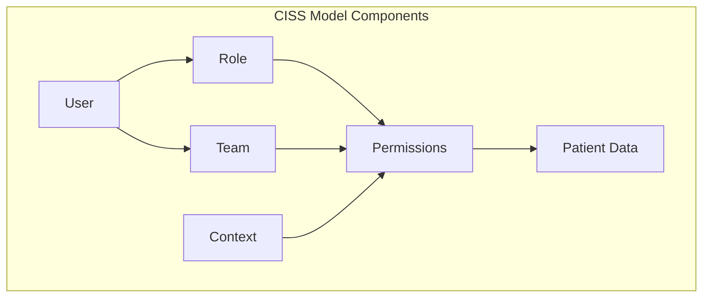
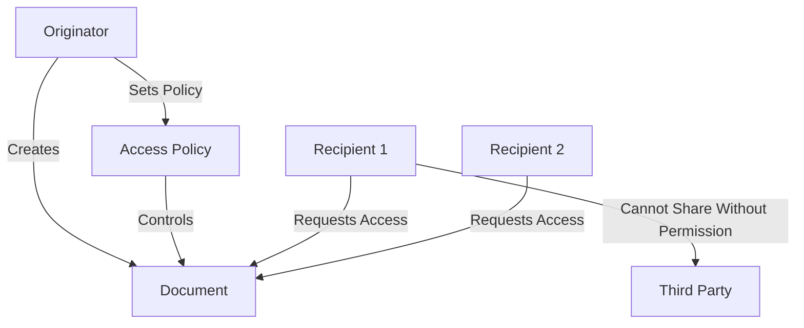
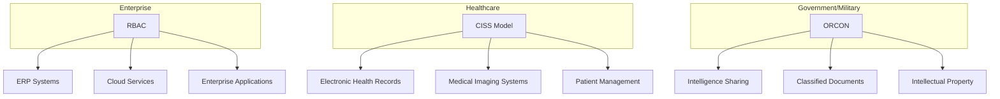

# Security Models: BLP, Biba & Chinese Wall 🧱

> *"I've got an exam in 12 hours, help me understand these models!"* edition

## Overview of Security Models



## Bell-LaPadula Model (BLP) 🔒

### What Is It?
A **confidentiality-focused** security model developed for military applications that prevents information from flowing to lower security levels.

### Key Concepts
- **Security Levels**: Hierarchical classifications (Unclassified → Confidential → Secret → Top Secret)
- **Security Categories**: Non-hierarchical compartments (Nuclear, Crypto, Intelligence)
- **Security Clearance**: Combination of level and categories assigned to subjects
- **Security Classification**: Combination of level and categories assigned to objects

### The Two Main Rules



1. **Simple Security Property (No Read Up)** 📖
   - A subject cannot read an object at a higher security level
   - Example: A Secret-cleared analyst cannot read Top Secret documents

2. ***-Property (Star Property / No Write Down)** ✍️
   - A subject cannot write to an object at a lower security level
   - Example: A Top Secret-cleared officer cannot write to a Secret document

### Discretionary Security Property
- Additional DAC-like controls can be applied on top of the mandatory rules

### Mathematical Notation
- For subject s and object o:
- Simple Security: s can read o only if level(s) ≥ level(o)
- *-Property: s can write o only if level(s) ≤ level(o)

### Pros ✅
- **Strong confidentiality**: Prevents information leakage to lower levels
- **Formal mathematical basis**: Well-defined security properties
- **Military-grade**: Designed for highly sensitive environments
- **Proven effectiveness**: Used in classified systems for decades

### Cons ❌
- **Rigid structure**: Inflexible for many business scenarios
- **No integrity protection**: Focuses only on confidentiality
- **Information flow restrictions**: Can impede normal operations
- **Covert channels**: Vulnerable to timing and storage channels

## Biba Integrity Model 🛡️

### What Is It?
The **integrity counterpart** to Bell-LaPadula, focusing on preventing corruption of data by lower integrity subjects.

### Key Rules



1. **Simple Integrity Property (No Read Down)** 📖
   - A subject cannot read an object at a lower integrity level
   - Example: Financial software cannot read untrusted data sources

2. ***-Integrity Property (No Write Up)** ✍️
   - A subject cannot write to an object at a higher integrity level
   - Example: A user-level process cannot modify system files

### Integrity Levels
- Typically defined as High, Medium, Low
- Based on trustworthiness, not secrecy

### Mathematical Notation
- For subject s and object o:
- Simple Integrity: s can read o only if integrity(s) ≤ integrity(o)
- *-Integrity: s can write o only if integrity(s) ≥ integrity(o)

### Pros ✅
- **Strong integrity protection**: Prevents data corruption
- **Complements BLP**: Addresses what BLP doesn't cover
- **Formal model**: Well-defined mathematical properties
- **Intuitive**: Makes sense that low integrity shouldn't affect high integrity

### Cons ❌
- **Restrictive information flow**: Can limit legitimate data access
- **No confidentiality focus**: Must be combined with other models
- **Implementation challenges**: Defining integrity levels is subjective
- **Operational limitations**: Can interfere with normal workflows

## Comparing BLP and Biba

| Aspect | Bell-LaPadula | Biba |
|--------|---------------|------|
| Focus | Confidentiality | Integrity |
| Read rule | No Read Up | No Read Down |
| Write rule | No Write Down | No Write Up |
| Primary concern | Information leakage | Data corruption |
| Origin | Military/government | Commercial systems |
| Levels based on | Sensitivity/secrecy | Trustworthiness/reliability |



## Chinese Wall Model 🧱

### What Is It?
A **conflict of interest** security model designed for commercial organizations like consulting firms and investment banks.

### Key Concepts
- **Objects**: Information assets (documents, data)
- **Company Datasets (CDs)**: All objects related to a single company
- **Conflict of Interest Classes (CoIs)**: Groups of competing companies



### Rules
1. **Simple Security Rule**: A subject can access an object only if:
   - The subject has already accessed an object from the same company dataset, OR
   - The subject has not accessed any object from a different company in the same conflict of interest class

2. ***-Property**: Write access is only permitted if:
   - Read access is permitted by the Simple Security Rule, AND
   - No read access exists for objects from a different company dataset

### Example
- If a consultant has accessed Bank A's data, they cannot access Bank B's or Bank C's data (competitors)
- They can still access Oil X's data (different conflict of interest class)

### Pros ✅
- **Business-oriented**: Designed for commercial rather than military needs
- **Prevents conflicts of interest**: Ideal for consulting, legal, financial services
- **Dynamic access**: Permissions change based on access history
- **Balances security and usability**: Allows access across non-competing companies

### Cons ❌
- **Complex implementation**: Requires tracking access history
- **Sanitized information issues**: Doesn't handle derived information well
- **Classification challenges**: Defining conflict classes can be difficult
- **Temporal problems**: Long-term consultants may be too restricted over time

## Exam Tips 📝

### For Bell-LaPadula:
- **Remember**: Protects **confidentiality**
- **Key rules**: No Read Up, No Write Down
- **Example**: Military classification system
- **Weakness**: Doesn't protect integrity

### For Biba:
- **Remember**: Protects **integrity**
- **Key rules**: No Read Down, No Write Up (opposite of BLP!)
- **Example**: Financial systems, critical infrastructure
- **Weakness**: Doesn't protect confidentiality

### For Chinese Wall:
- **Remember**: Prevents **conflicts of interest**
- **Key structure**: Conflict classes containing company datasets
- **Example**: Consulting firms, investment banks
- **Unique feature**: Access rights change based on user's access history

## Quick Comparison Table

| Model | Primary Goal | Key Mechanism | Real-world Application |
|-------|-------------|---------------|------------------------|
| Bell-LaPadula | Confidentiality | No Read Up, No Write Down | Military systems, classified information |
| Biba | Integrity | No Read Down, No Write Up | Critical systems, financial applications |
| Chinese Wall | Conflict prevention | Dynamic separation based on history | Consulting firms, financial advisors |

---

Remember: BLP is about keeping secrets secret (military), Biba is about keeping trusted data trustworthy (systems integrity), and Chinese Wall is about keeping competitors' information separate (business ethics).

Good luck on your exam! 🍀

--------
------

# Access Control Models: RBAC, CISSP & ORCON 🔑

> *"I need to pass this exam tomorrow!"* edition

## Role-Based Access Control (RBAC) & NIST Model 👥

### What Is RBAC?
RBAC assigns permissions to **roles** rather than directly to users. Users are then assigned to appropriate roles based on their job functions.



### NIST RBAC Model Levels

NIST defined a standard RBAC framework with four increasing levels of functionality:



1. **Core RBAC**
   - Basic user-role assignment
   - Basic permission-role assignment
   - User-session management
   - Core operations (create, delete, assign)

2. **Hierarchical RBAC**
   - Role hierarchies with inheritance
   - Senior roles inherit permissions from junior roles
   - Example: Manager role inherits all permissions of Employee role

3. **Constrained RBAC**
   - Separation of Duty (SoD) constraints
   - Static SoD: Restrictions on role assignments
   - Dynamic SoD: Restrictions on role activations in sessions
   - Example: A user cannot be both Payment Approver and Payment Creator

4. **Symmetric RBAC**
   - Permission-role review capabilities
   - Ability to query which roles have which permissions

### RBAC Components

- **Users**: Human users or automated agents
- **Roles**: Job functions or titles within an organization
- **Permissions**: Approved operations on protected objects
- **Operations**: Actions (read, write, execute, etc.)
- **Objects**: Resources requiring access control
- **Sessions**: Mapping between a user and activated roles

### Example RBAC Implementation

```
User: Dr. Smith
Assigned Roles: Physician, Department Head

Role: Physician
Permissions:
  - Read patient records
  - Write medical notes
  - Order lab tests

Role: Department Head
Permissions:
  - Approve time off
  - View department budget
  - Assign patient loads
```

### Pros ✅
- **Simplified administration**: Manage roles, not individual permissions
- **Reduced complexity**: Fewer assignments to manage
- **Business alignment**: Roles map to organizational structure
- **Principle of least privilege**: Users get only needed permissions
- **Regulatory compliance**: Easier to demonstrate access controls

### Cons ❌
- **Role explosion**: Large organizations may need many roles
- **Role engineering challenges**: Defining appropriate roles is difficult
- **Context limitations**: Basic RBAC doesn't handle contextual factors
- **Maintenance overhead**: Roles must be updated as organization changes
- **Permission creep**: Users may accumulate unnecessary roles over time

## Clinical Information Systems Security (CISS) Model 🏥

### What Is It?
A specialized security model designed for healthcare environments that balances patient privacy with the need for healthcare providers to access information.

### Key Concepts



1. **User-Role Assignment**
   - Healthcare-specific roles (Physician, Nurse, Specialist, etc.)
   - Professional qualifications determine role assignment

2. **Patient-Provider Relationship**
   - Access based on treatment relationship
   - Providers can only access their patients' records

3. **Context-Based Access**
   - Emergency situations may override normal restrictions
   - Location and time may affect access rights

4. **Team-Based Access**
   - Care teams share access to patient information
   - Team membership is dynamic based on patient needs

### Access Control Principles

- **Need-to-Know**: Access limited to information needed for care
- **Temporal Constraints**: Access limited to active treatment period
- **Break-Glass Procedure**: Emergency override with mandatory auditing
- **Delegation**: Temporary transfer of access rights

### Example Scenario

```
Normal Access:
- Dr. Jones (Cardiologist) can access cardiac records for her patients
- Nurse Smith can access vital signs for patients on his ward

Emergency Override:
- ER Doctor can access any patient record during emergency
- System logs override and requires justification
```

### Pros ✅
- **Patient privacy**: Protects sensitive health information
- **Flexible for healthcare**: Accommodates clinical workflows
- **Emergency provisions**: Allows critical access when needed
- **Team-based care**: Supports collaborative healthcare models
- **Regulatory alignment**: Designed for HIPAA compliance

### Cons ❌
- **Implementation complexity**: Many factors to consider
- **Contextual challenges**: Defining emergencies is subjective
- **Administrative overhead**: Managing relationships and teams
- **Potential delays**: Access controls may impede urgent care
- **Audit burden**: Extensive logging requirements

## Originator Controlled Access Control (ORCON) 🔒

### What Is It?
ORCON ensures that the **original creator** of information retains control over its dissemination, even after it's been shared with others.



### Key Principles

1. **Originator Control**
   - Creator of information specifies who can access it
   - Creator maintains control even after distribution

2. **No Transitive Access**
   - Recipients cannot share information with others
   - All further sharing requires originator approval

3. **Persistent Protection**
   - Access controls remain with the information
   - Controls cannot be removed without originator consent

4. **Propagation of Control**
   - Derived works inherit original restrictions
   - Modifications don't eliminate access constraints

### Implementation Approaches

- **Digital Rights Management (DRM)**: Technical enforcement of sharing restrictions
- **Metadata Tags**: Embedded control information
- **Trusted Systems**: Hardware/software that enforces ORCON policies
- **Cryptographic Mechanisms**: Encryption with controlled key distribution

### Example Use Cases

- **Intelligence sharing**: Agencies sharing classified information
- **Proprietary business documents**: Trade secrets, strategic plans
- **Medical research data**: Patient data shared between institutions
- **Copyright protection**: Digital media distribution

### Pros ✅
- **Strong information control**: Originators maintain authority
- **Prevents unauthorized redistribution**: Limits data leakage
- **Chain of custody**: Clear tracking of information flow
- **Supports need-to-know**: Information only goes to approved recipients
- **Accountability**: Clear responsibility for information sharing

### Cons ❌
- **Technical implementation challenges**: Difficult to enforce completely
- **Operational friction**: Can impede legitimate information sharing
- **Scalability issues**: Managing permissions becomes complex
- **Potential single point of failure**: Dependent on originator availability
- **Circumvention risk**: Users may find workarounds (e.g., screenshots)

## Comparison Table

| Feature | RBAC | CISS Model | ORCON |
|---------|------|------------|-------|
| Primary focus | Job functions | Patient care | Information origin |
| Access based on | Roles | Roles + relationships + context | Creator's rules |
| Best suited for | Enterprise environments | Healthcare systems | Classified/proprietary info |
| Key strength | Administrative efficiency | Balance of access and privacy | Control after sharing |
| Key weakness | Role explosion | Implementation complexity | Enforcement difficulty |
| Dynamic aspects | Limited | High (context-based) | Medium (originator updates) |

## Exam Tips 📝

### For RBAC:
- **Remember the NIST levels**: Core → Hierarchical → Constrained → Symmetric
- **Key benefit**: Administrative simplicity through role abstraction
- **Key challenge**: Role explosion and engineering
- **Example**: A bank teller role with permissions to process deposits but not loans

### For CISS Model:
- **Remember**: Healthcare-specific model balancing privacy and care needs
- **Key features**: Treatment relationships, teams, context, emergency override
- **Unique aspect**: Break-glass procedures for emergencies
- **Example**: A doctor can access records only for their patients, except in emergencies

### For ORCON:
- **Remember**: Creator maintains control even after sharing
- **Key principle**: No redistribution without originator permission
- **Implementation**: DRM, metadata, trusted systems
- **Example**: An intelligence report that can't be shared with allies without creator approval

## Real-World Applications



---

Remember: RBAC is about "what you do" (roles), CISS is about "who you're treating" (patient relationships), and ORCON is about "who created it" (originator control).

Good luck on your exam! 🍀